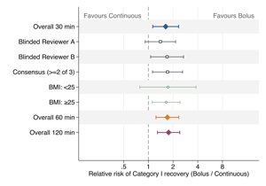
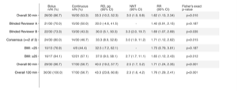
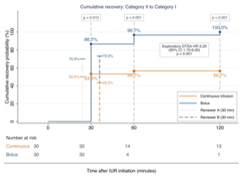

# EFM-recovery-RCT-stata

Stata analysis code for the randomised controlled trial:

> Anannaweenusorn T, Bhukdee D, Konchalard K, Suta J, Meepon B.  
> *Recovery Rate from Category II to Category I Electronic Fetal Monitoring
> Tracings in Pregnant Women Receiving Bolus vs Continuous Intravenous Fluid
> Administration: A Randomized Controlled Trial.*

This repository is the Stata code bundle referenced in the manuscript's Data
and Code Availability statement. It is a minimal release package rather than the full
private analysis workspace. It runs end-to-end on a bundled synthetic example
dataset, so reviewers can reproduce the manuscript-facing tables and figures
without access to participant-level trial data.

The manuscript analysis was performed in Stata 19.5. The scripts set
`version 17` and use built-in Stata commands only, so Stata 17 or later should
run the release bundle. No SSC packages are required.

## Output Preview

| | | |
|:---:|:---:|:---:|
|  |  |  |
| **Figure 2a**: primary-effects RR forest | **Figure 2b**: numeric effect table | **Figure 3**: cumulative recovery + exploratory DTSA |

Previews are reduced-size, aggregate-only renderings from the bundled synthetic run.
The full pipeline map, with stage, output, and data-source tables, is in [`PIPELINE_STRUCTURE.md`](PIPELINE_STRUCTURE.md).

## What This Reproduces

- **Figure 2**: primary-effects forest plot and numeric effect table
- **Figure 3**: cumulative recovery curves and exploratory DTSA cloglog HR
- **Table 1**: baseline characteristics
- **Table S1**: delivery and neonatal outcomes
- **Table S2**: maternal-fetal physiological surrogate outcomes
- **Table S3**: inter-rater agreement
- in-text BMI-adjusted logistic and BMI-stratified subgroup analyses

The current synthetic run is calibrated to the aggregate values in the
submission manuscript:

| Result | Manuscript value | Synthetic release run |
|---|---:|---:|
| 30-minute recovery | Bolus 26/30 vs Continuous 16/30 | 26/30 vs 16/30 |
| Risk difference | 33.3 pp, 95% CI 10.2 to 52.3 | 33.3 pp, 95% CI 10.2 to 52.3 |
| Relative risk | 1.62, 95% CI 1.13 to 2.34 | 1.625, 95% CI 1.13 to 2.34 |
| Fisher exact P | 0.01 | 0.0101 |
| NNT | 3, 95% CI 1.9 to 9.8 | 3.0, 95% CI 1.9 to 9.8 |
| Exploratory DTSA cloglog HR | 3.20, 95% CI 1.71 to 6.00 | 3.20, 95% CI 1.70 to 6.00 |
| Reviewer A sensitivity | RR 1.40, P = 0.19 | RR 1.40, P = 0.187 |
| Reviewer B sensitivity | RR 1.69, P = 0.035 | RR 1.69, P = 0.035 |

## Repository Layout

```text
.
├── README.md                     # this file
├── LICENSE                       # BSD 3-Clause
├── DATA_DICTIONARY.md            # variable + workbook schema
├── src/                          # all analysis code (run from the repo root)
│   ├── master.do                 # pipeline entry point: runs every step
│   ├── config.do                 # paths and environment variables
│   ├── params.do                 # scientific constants and figure colours
│   ├── lib_stats.do              # shared helpers (Cohen's kappa, p-value text)
│   ├── 00_preprocess.do          # workbook -> analysis datasets
│   ├── 01_table1.do              # Table 1
│   ├── 02_primary.do             # primary outcome and BMI-adjusted sensitivity
│   ├── 03_subgroups_bmi.do       # BMI subgroup analysis
│   ├── 04_cumulative.do          # Figure 3 and exploratory DTSA
│   ├── 05_doppler.do             # Table S2
│   ├── 06_secondary.do           # Table S1
│   ├── 07_reliability.do         # Table S3
│   └── 08_figure2_forest.do      # Figure 2
├── tests/                        # Stata-native toy tests (run from repo root)
└── data/synthetic/               # public synthetic workbook + aggregate inputs
```

Run every command **from the repository root** (e.g. `do src/master.do`) so the
relative `src/`, `data/`, and `output/` paths resolve. Generated files are
written to `data/clean/` and `output/run_*`; both are ignored by Git.

## Install Requirements

Required:

- Stata 17 or later
- a shell that can run Stata in batch mode
- Git if you are cloning the repository

Optional, only if regenerating the synthetic workbook:

- Python 3.10 or later
- `numpy`
- `openpyxl`

The Stata pipeline itself has no Python dependency.

## Clone Or Download

```bash
git clone https://github.com/cmb-chula/EFM-recovery-RCT-stata.git
cd EFM-recovery-RCT-stata
```

If you received a zip archive instead, unpack it and `cd` into the unpacked
folder.

## Find Your Stata Batch Command

On macOS with StataNow, the command may be:

```bash
/Applications/StataNow/StataSE.app/Contents/MacOS/stata-se
```

If Stata is already on your `PATH`, this may work:

```bash
stata-se
```

On Windows or Linux, use the Stata batch executable provided by your Stata
installation. The examples below use `stata-se`; replace it with the full path
to your Stata executable if needed.

## Run The Tests

Run tests from the repository root:

```bash
stata-se -b -q do tests/run_all_tests.do
```

Expected result in `run_all_tests.log`:

```text
TEST SUMMARY: 6 passed, 0 failed
ALL TESTS PASSED
```

The tests use small hand-computable toy datasets. They do not require or read
the real trial CRF.

## Run The Synthetic Example

With no environment variables set, the pipeline reads:

```text
data/synthetic/synthetic_crf.xlsx
data/synthetic/reviewer_aggregate.csv
data/synthetic/inter_rater.csv
```

Run:

```bash
stata-se -b -q do src/master.do
```

Outputs are written to:

```text
output/run_<YYYYMMDD>_<HHMMSS>/
```

Key files:

```text
Figure_2a_forest.png
Figure_2b_effect_table.png
Figure_3_cumulative_recovery.png
Table_1_baseline_characteristics.csv
Table_S1_delivery_neonatal.csv
Table_S2_physiological_surrogates.csv
Table_S3_reliability.csv
bmi_subgroup.csv
cumulative_recovery.csv
primary_effects_forest.csv
primary_outcome.csv
run_manifest.csv
pipeline.log
```

## Run On The Restricted Real CRF

The real CRF contains participant-level confidential data. Do not place it in a
Git repository, do not print rows, and do not upload it to GitHub. The
`.gitignore` is intentionally fail-closed for spreadsheet, Stata, CSV, and
archive data files.

Create or use a restricted local folder outside the Git-tracked source tree,
for example:

```bash
mkdir -p "$HOME/restricted_efm_crf"
```

That folder must contain:

```text
<real CRF workbook>.xlsx
reviewer_aggregate.csv
inter_rater.csv
```

The two CSV files are aggregate/reliability inputs used for Figure 2/3 reviewer
rows and Table S3. If they are absent, the corresponding deliverables cannot be
fully reproduced; `master.do` fails closed rather than silently producing an
incomplete manuscript bundle.

Run with explicit paths:

```bash
export EFM_RAW_DIR="$HOME/restricted_efm_crf"
export EFM_RAW_XLSX="<real CRF workbook>.xlsx"
export EFM_OUTPUT_DIR="$HOME/restricted_efm_outputs"

stata-se -b -q do src/master.do
```

After running on real data, verify that no restricted artifacts are staged:

```bash
git status --ignored --short
```

The expected state is that real data, `data/clean/`, and `output/` are ignored.
Never override `.gitignore` to force-add real CRF files or generated
participant-level analysis datasets.

## Regenerate The Synthetic Dataset

This is optional. The checked-in synthetic files are already generated.

```bash
cd data/synthetic
python3 -m venv .venv
source .venv/bin/activate
python -m pip install -r requirements.txt
python generate_synthetic_data.py
```

The generator prints aggregate calibration counts only. It does not use real
participant data.

## Statistical Methods

Every estimate is produced by built-in Stata commands or transparent small
helpers:

| Quantity | Implementation |
|---|---|
| Per-arm proportion CI | `cii proportions n k, wilson` and `, exact` |
| Fisher exact test, RR, RD | `csi a b c d, exact` |
| Newcombe-Wilson RD CI | two Wilson intervals combined by Newcombe method 10 |
| Primary RR | `glm y i.trt, family(binomial) link(log) eform vce(robust)` |
| BMI-adjusted sensitivity | `logit y i.trt c.bmi, vce(robust)` and `margins, dydx(trt)` |
| BMI subgroup | per-stratum `csi`; Breslow-Day OR-homogeneity via `cc, by() bd` |
| DTSA | exploratory/supportive `cloglog event i.trt i.period, vce(cluster id)` |
| Physiological surrogates | `ranksum`; ANCOVA `regress post i.trt c.pre, vce(robust)` |
| Reliability | Cohen's kappa helper in `lib_stats.do`, cross-checked against `kap` |
| Baseline continuous rows | Welch `ttest, unequal` |

No statistical or clinical result in this release should be changed only for
software polish. Any change that alters the manuscript values above should be
treated as a new statistical analysis and reviewed separately.

## Data Safety

The real CRF and generated real-data outputs are not public. They may contain
hospital numbers, timestamps, clinical observations, and derived participant-
level analysis records.

This repository intentionally tracks only:

- Stata source code
- documentation
- tests using toy data
- the bundled synthetic workbook
- two synthetic aggregate/reliability CSV inputs

It intentionally ignores:

- real CRF files
- `data/clean/`
- `output/`
- Stata logs
- local OS/editor files
- spreadsheet, CSV, Stata, SAS, parquet, pickle, and archive data files outside
  the synthetic allow-list

## License

This code is released under the **BSD 3-Clause License**; see `LICENSE`.

The license covers the public source code and synthetic example data. It does
not grant access to restricted participant-level trial data.

## AI Assistance

Claude Code (Anthropic, Claude Opus 4.7, accessed May 2026) and Codex (OpenAI,
GPT-5.5, accessed May 2026) were used to assist with Stata code development and
debugging and language revisions. No participant-level QSMH trial data were
shared with any AI tool at any stage, in compliance with the Thailand Personal
Data Protection Act B.E. 2562 (2019). All AI-assisted outputs were reviewed,
edited, and verified by the authors, who take full responsibility for the
analytical implementation and the manuscript content.

## Citation

If you use this code, cite the trial manuscript and the software archive DOI if
one has been assigned.
